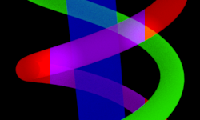

This is an experiment to:

- Allow applying color changes to single objects in a deep EXR render with clean
edge antialiasing, to avoid the artifacts caused by masks.
- Allow it to be done using simple tools like Photoshop, instead of heavy compositing
packages like Nuke.

The red helix is a single layer even where it goes underneath the cylinder, and
color and exposure changes have been made to it with ordinary Photoshop tools:



This works with image editing software without additional plugins, and requires no
extra renderer support beyond standard deep EXR rendering and object IDs.  This
idea is based on <https://github.com/MercenariesEngineering/openexrid>.

This tool separates objects in a deep EXR file by object ID, and generates a layer
for each file that can be edited separately and blended together.  The only trick
is that the layers are blended together with additive blending rather than normal
blending.

Instructions
------------

- Render a deep EXR file with object ID samples.  This is tested with Arnold renders
out of Maya.  The EXR channel names should be "R", "G", "B", "A", "Z", "ZBack" and
"id".
- Run the tool:

```
exrflatten input.exr "output <name>.exr"
```

``"<name>"`` in the output will be substituted with the object ID, giving filenames like
"output #1.exr".  Be sure to include quotes around the output file.

- In Photoshop, add all output EXRs to a document.  Be sure they're aligned identically.
(The easiest way to do this is to zoom out so the whole document is visible, and then
drag each EXR into the document.  For some reason, zooming out first convinces Photoshop
to align the image correctly.)  Set all layer blending modes to "Linear dodge (add)".
- Add a layer to the bottom, and fill with black.  This is needed for the layers to
combine correctly.

The image should now look like the original render, and you can make color adjustments
to individual object layers.

Object names
------------

By default, output files will be named by object ID, so <name> will be replaced with a
number.  To name objects, add an EXR string attribute named "ObjectId/<id>" for each ID,
with the name as the value.  See sample/sample.exr for an example.

Sample
------

See sample/sample.psd shows how this can be used.  This sample applies several color
adjustments to a red helix: changing its color with a hue shift, adjusting its exposure
and applying a photo filter.  Each adjustment only affects the red helix, blending with
the green helix and blue cylinder that its transparency interacts with.

The source scene ``sample.ma`` can be rendered with Maya 2017 using Arnold, which
will output sample.exr.  To generate the flattened images, run:

```
exrflatten sample.exr sample_'<name>'.exr
```

The PSD is linked to these files, and will update automatically.  (If Photoshop doesn't
connect the linked images correctly, you may need to re-link them the first time.)

Limitations
-----------

This is an experiment, and hasn't been used on very complex scenes.

This doesn't currently perform "tidying" of images, which means it will probably give
incorrect results if the EXR file contains volumes (samples with nonzero depth).

The names of input channels are fixed.  The basic names are standardized, but they
can be different if EXR layers are used.

Transparency in the input file won't work if it shows through to the background and not
onto another object.  To apply the original contribution of a sample in a way that will
give the same input in additive blending, the final contribution is used as the alpha
channel.  For this to work, the background needs to be solid black.  This can be worked
around by using the original image's alpha channel as a mask on the final output.

Algorithm
---------

By reorganizing samples from over blending to additive blending, layer compositing
becomes independent of order: you can add layers together in any order you want and
get the same result.  From this we can combine all samples for each object ID and
output a layer for each.

Layers (or samples for deep EXR images) are normally composited with "over" blending:

bottom = (top\*alpha) + (bottom\*(1-alpha))

Each layer's contribution is added based on its alpha, and the contribution of all
layers underneath it is reduced proportionally.

Instead of destructively reducing the contribution of lower layers by accumulating
them into a single output buffer, we track the contribution fo each layer individually.
When we add a layer, we reduce the contribution of each layer underneath it, but
remember each layer separately.

This gives us a list of the (top\*alpha) terms in the above formula, with their future
(\*(1-alpha)) adjustments already applied into their alpha value.  (Adding all of these
together would be the same as the original compositing.)  We can then combine samples
with the same object ID and save them separately.

